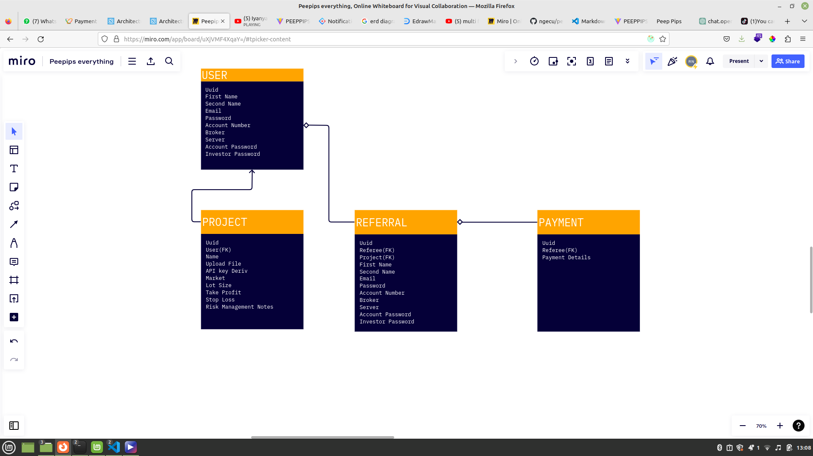
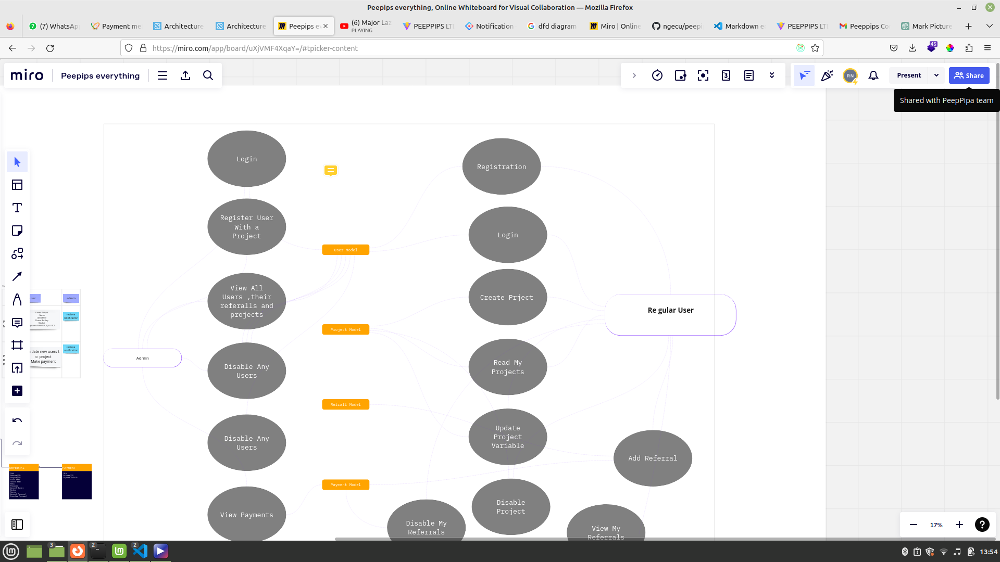

# PEEPPIPS OFFICIAL BACKEND DOCUMENTATION

## Section 1: Getting Started

In this part, we get an introduction to the backend ,an overview of its different components and making API calls. Additionally, you will develop an understanding of how to configure your development environment correctly, before you start developing full-fledged web applications with these technologies.

### Postman Installation and Usage

Welcome! This section of the Learning Center contains topics about how to get started using Postman.

To get up and running with Postman, check out the following:

You can get started right away by using the Postman web app, but you can also install the Postman desktop app. See [Installing and updating Postman](https://learning.postman.com/docs/getting-started/installation-and-updates/)

Once you're in Postman, check out how to [navigate Postman](https://learning.postman.com/docs/getting-started/navigating-postman/). After you're familiar with the interface, try [sending your first request](https://learning.postman.com/docs/getting-started/sending-the-first-request/)

Create a Postman account. Then, learn more about [managing your account](https://learning.postman.com/docs/getting-started/postman-account/), [customizing your Postman profile](https://learning.postman.com/docs/getting-started/postman-profile/), and [setting up Postman](https://learning.postman.com/docs/getting-started/settings/)

A great place to find APIs is the Postman Public API Network. Learn more on how to use it at exploring the Public API Network.

After you've created a few requests, you'll want to organize them into collections and workspaces. Check out creating your [first collection](https://learning.postman.com/docs/getting-started/creating-the-first-collection/) and [creating a workspace](https://learning.postman.com/docs/getting-started/creating-your-first-workspace/)

You can also import requests and other data into Postman, and export it for use with other programs. Check out [importing and exporting data](https://learning.postman.com/docs/getting-started/importing-and-exporting-data/)

We can now have an overview of the skeleton application

## Section2: Overview of the skeleton application 

The skeleton application provides a foundation for developing FERN (Firebase, Express, React, and Node.js) web applications. It encapsulates rudimentary features and workflows commonly found in FERN applications. By building the skeleton application, we aim to demonstrate the development, organization, and execution of code for general web applications using this stack. The skeleton is designed to be simple and easy to extend, serving as a base application for developing different FERN applications.

Feature breakdown The skeleton application includes the following features implemented with CRUD (Create, Read, Update, Delete) and authentication-authorization capabilities:

1. Sign up: Users can register by creating a new account using an email address.
2. User list: Any visitor can view a list of all registered users.
3. Authentication: Registered users can sign in and sign out.
4. Protected user profile: Only registered users can view individual user details after signing in.
5. Authorized user edit and delete: Only a registered and authenticated user can edit or remove their own user account details.
6. Create Projects:Registered users can create projects,which is based on their own bot for modification or a new strategy to be implemented
7. Protected Projects:Only registered users can view their own projects after signing in
8. Update Project Variables:Registered users can change the set project variables
9. Disable Projects:Registered users can disable or suspend their projects
10. Invite Referrals: Registered users have the ability to invite referrals to join the application using the user’s applications/strategies.The referral system encourages new user sign-ups and provides incentives or rewards for successful referrals. This feature helps grow the user base and fosters a sense of community within the application.
11. Disable Referrals: Registered users also have the option to disable or suspend their referral program. They can choose to temporarily or permanently stop accepting new referrals.Disabling referrals can be useful in situations where the referral program needs to be reviewed, modified, or temporarily halted. This feature gives users control over their referral program and allows them to make adjustments as needed.

By building and understanding these backend components, we establish the foundation for a secure and efficient FERN web application. In subsequent chapters, we will integrate the React frontend to create a complete full-stack application.

### Architecture Design

for more visualization , [click here][my-link] 

[1]: https://en.wikipedia.org/wiki/Markdown
[my-link]: https://miro.com/welcomeonboard/RERGTDdjd1N1YWFvc2VZM3U5QVRsRlY0OVJxV0VWbDF6eFZ0VUQwUHFtQjhwQ2Z4VXQ3OThpZ2VqNTFKUWNRYnwzNDU4NzY0NTU0NzY5MTM3NzgyfDI=?share_link_id=510785322250

#### A. SYSTEM DESIGN DIAGRAM

The following diagram represents the high-level system design for the user registration, project creation, and user referral functionality:

The diagram illustrates the key components of the system:

1. User Interface: Represents the client-side user interface where users interact with the system. It can be a web application, mobile app, or any other client platform. Users use the interface to register, create projects, and refer other users.

2. Backend Server: Acts as the central processing unit of the system. It receives requests from the user interface, handles business logic, performs data operations, and communicates with the database and external services.

3. Database: Stores user information, project details, referral data, and other relevant data. It provides persistent storage for the system and allows efficient retrieval and manipulation of data.

4. External Services: Represents external services that the system integrates with, such as email services for sending notifications, authentication services for user authentication, and analytics services for tracking user activity and referral metrics. These services enhance the functionality and performance of the system.

The arrows depict the flow of information and requests between the components:

1. User interface communicates with the backend server to perform actions like user registration, project creation, and referral activities.

2. The backend server interacts with the database to store and retrieve data related to users, projects, and referrals.

3. External services are integrated with the backend server to provide additional functionalities, such as sending notifications or performing authentication.

This system design diagram provides a visual representation of the overall architecture and component interactions. It helps in understanding the system's structure and facilitates discussions and further design considerations.

#### B. ERD DIAGRAM

The following is an Entity-Relationship Diagram (ERD) that represents the relationships between the entities in the system:

The ERD represents the main entities in the system and their relationships:

1. User: Represents a registered user in the system. It contains attributes like id, first_name, last_name, email, and password.

2. Project: Represents a project created by a user. It has attributes such as id, user_id (foreign key referencing the User entity), title, description, created_at, and updated_at.

3. Referral: Represents the referral relationship between users. It contains attributes like id, user_id (foreign key referencing the User entity), referred_user_id, and created_at. A user can refer multiple users.

The diagram illustrates the cardinality of relationships:

1. One user can have multiple projects (1-to-many relationship between User and Project).
2. One user can make multiple referrals (1-to-many relationship between User and Referral).

The ERD provides a visual representation of the entities and their relationships in the system. It helps in understanding the data structure and the associations between entities, enabling efficient database design and development.

#### C. DFD DIAGRAM

The Data Flow Diagram (DFD) illustrates the flow of data and the processes involved in the system. The diagram consists of four main components: processes, data stores, external entities, and data flows.

The data flows in the following manner:

1. User registers by providing user details.
2. The system/server receives the user registration data and saves it in the database.
3. User creates a new project, and the project details are sent to the system/server.
4. The system/server saves the project data in the database.
5. User refers another user, and the referral information is sent to the system/server.
6. The system/server saves the referral data in the database.
7. User can view their projects by retrieving project data from the database.
8. User can view their referrals by retrieving referral data from the database.

The DFD highlights the interactions between the user, the system/server, and the database. It provides an overview of how data flows through the system and the processes involved in handling user requests and storing data in the database.

The system allows users to register, create projects which contain trading bots in accordance to the user's specifics, and refer more users to enroll in their created projects. The system aims to facilitate user engagement, project management, and referral growth within the application.

### High-Level Architecture Overview

The system follows a client-server architecture, where the client interacts with the frontend user interface and communicates with the backend server. The backend server handles user registration, project creation, user management, and referral functionalities.

Backend Components:

Backend Server: Manages the core functionalities of the system, including user registration, project creation, user management, and referral tracking.

Database: Stores user information, project details, and referral data.

External Services: Include email services for sending notifications, authentication services for user authentication, and analytics services for tracking user activity and referral metrics.

#### System Flow

The following steps describe the flow of actions within the system:

User Registration:

Users register by providing their details, including name, email, and password.

The client sends the registration request to the backend server.

The backend server validates the input and creates a new user record in the database.

The user receives a confirmation email or notification for successful registration.

Project Creation:

Registered users can create projects, either based on their own bot for modification or a new strategy to be implemented.

The client interface allows users to input project details, such as project name, description, and settings.

The client sends a request to the backend server to create the project.

The backend server validates the request, creates a new project record in the database, and associates it with the user who created it.

User Referrals:

Registered users have the ability to invite referrals to join the application using their own projects/strategies.

The client provides options for users to generate referral links or send email invitations.

When a referral signs up using the referral link or invitation, the system tracks the referral and associates it with the referring user and project.

Referral data, such as referral count and successful referrals, is stored in the database for analytics and rewards tracking.

Security and Authentication

To ensure the security and authentication of users, the system incorporates the following measures:

User registration requires providing a unique email address and password.

Passwords are stored securely by encrypting them before storing them in the database.

User authentication is performed using tokens or sessions to ensure authorized access to protected endpoints and features.

API endpoints that involve sensitive operations or user data are protected and can only be accessed by authenticated users.

### API requests defined

APIs provide a structured way for one application to access the capabilities of another application. Typically, this communication happens over the internet by way of an API server. A client application (like a mobile app) sends a request to the server, and after the request processes the server returns a response to the client.

A request includes the URL of the API endpoint and an HTTP request method. The method indicates the action you want the API to perform. Here are some of the most common methods:

    GET retrieves data from an API.
    POST sends new data to an API.
    PATCH and PUT update existing data.
    DELETE removes existing data.

### User Model and Its API CRUD EndPoints 

Before we dive into the user model and endpoints,the base URL for all API requests is: https://peeppipsbackend.onrender.com

The user model will define the user details to be stored in the MongoDB database,
and also handle user-related business logic such as password encryption and user
data validation. The user model for this skeletal version will be basic with support for the following attributes:

| Field Name     | Type   | Description                                                       |
|----------------|--------|-------------------------------------------------------------------|
| UUID           | UUID   | This is the Primary Key of this model                             |
| First Name     | String | Required field to store the user's first name                     |
| Second Name    | String | Required field to store the user's second name                    |
| Email          | String | Required unique field to store the user's email and identify each account (only one account allowed per unique email) |
| Password       | String | A required field for authentication. The database will store the encrypted password and not the actual string for security purposes |
| Account Login  | String | Required field to store the user's trading login number. The database will store the encrypted password and not the actual string for security purposes |
| Account Password | String | Required field to store the user's trading password. The database will store the encrypted password and not the actual string for security purposes |
| Strategy Type  | String | Required field to store the user's strategy request, either new or upload his/her strategy for modification |
| Created        | Date   | Automatically generated timestamp when a new user account is created |
| Updated        | Date   | Automatically generated timestamp when existing user details are updated |

To enable and handle user CRUD operations on the user database, the backend will implement and expose API endpoints that the frontend can utilize in the views, as follows:

| Operation          | API route          | HTTP Method |
|--------------------|--------------------|-------------|
| Create a user      | /api/users         | POST        |
| List all users     | /api/users/:userID | GET         |
| Fetch a user       | /api/users/:userID | GET         |
| Update a user      | /api/users/:userID | PUT         |
| Delete a user      | /api/users/:userID | DELETE      |
| User sign-in       | /api/users/signin  | POST        |
| User sign-out      | /api/users/signout | GET         |

Some of these user CRUD operations will have protected access, which will require
the requesting client to be authenticated, authorized, or both, as defined by the
feature specifications. The last two routes in the table are for authentication and will allow the user to sign-in and sign-out. For the applications developed in this book, we will use the JWT mechanism to implement these authentication features, as discussed in more detail in the next section.

#### Register A User

Endpoint: /api/users

Method: POST

Request Body:

    {
        uid "902d47be-e1a4-4d38-bb4c-d9e0f24d7424" ,
        firstName "Robinson",
        secondName "Ngecu",
        email "ngecu16@gmail.com",
        isAdmin false
        password "$2a$10$CBw.NIanBcGEAKAzuVcMDOeNYR5DfEgEcKYNAqrYv2MHabH3o7CNW"
    }

Response
    
    201 Created:  {uid "902d47be-e1a4-4d38-bb4c-d9e0f24d7424" ,firstName "Robinson",secondName "Ngecu",email "ngecu16@gmail.com",isAdmin false}
    
    400 Bad Request: Invalid request payload.

#### List all Users

Retrieve a list of all registered users.

Endpoint: /api/users

Method: GET
Response

    200 OK: List of users retrieved successfully.

#### Fetch a User

Retrieve user details by ID.

Endpoint: /api/users/:userID

Method: GET

Path Parameters:

    :userID (string): The ID of the user to fetch.

Response

    200 OK: User details retrieved successfully.
    404 Not Found: User not found.

#### Update a User

Update user details.

Endpoint: /api/users/:userID

Method: PUT

Path Parameters:

    :userID (string): The ID of the user to update.

Request Body:

{
  "firstName": "Updated First Name",
  "email": "updated@peeppips.com"
}

Response

    200 OK: User details updated successfully.
    400 Bad Request: Invalid request payload.
    404 Not Found: User not found.

#### Delete a User

Delete a user account.

Endpoint: /api/users/:userID

Method: DELETE

Path Parameters:

    :userID (string): The ID of the user to delete.

Response

    204 No Content: User deleted successfully.
    404 Not Found: User not found.

#### User Sign-In

Authenticate a user and obtain an access token.

Endpoint: /api/users/signin

Method: POST

Request Body:

{
  "email": "johndoe@example.com",
  "password": "password123"
}

Response

    200 OK: User authenticated successfully.
    400 Bad Request: Invalid credentials.

#### User Sign-Out

Sign out the currently authenticated user.

Endpoint: /api/users/signout

Method: GET
Response

    200 OK: User signed out successfully.

### Project Model and Its API CRUD EndPoints

The project model will define the user project details to be stored in the MongoDB database, and also handle user-related project logic such as strategy details,its variable,api keys etc. The project model for this skeletal version will be basic with support for the following attributes:

| Field Name        | Type   | Description                                                |
| ----------------- | ------ | ---------------------------------------------------------- |
| UUID              | UUID   | This is the Primary Key of this model                      |
| UserID            | UUID   | This is the Foreign Key linking to the user                |
| Project Name      | String | Required field to store the project name                   |
| Upload File       | String | Required field to store the link for the file stored in firebase storage |
| Deriv Api Key     | String | Required unique field to store the user's derive API key    |
| Market            | String | A required field for storing the market symbol required to trade |
| Lot Size          | Float  | Required field to store the lot size to use to trade       |
| Take Profit(Pips) | Float  | Required field to store the number of pips from the entry level to secure the profit |
| Stop Loss(Pips)   | Float  | Required field to store the number of pips from the entry level to stop losses |
| Created           | Date   | Automatically generated timestamp when a new user account is created |
| Updated           | Date   | Automatically generated timestamp when existing user details are updated |

To enable and handle project CRUD operations on the user database, the backend will implement and expose API endpoints that the frontend can utilize in the views, as follows:

| Operation           | API route                | HTTP Method |
| ------------------- | ------------------------ | ----------- |
| Create a project    | /api/projects            | POST        |
| List all projects   | /api/projects/:userID    | GET         |
| Fetch a project     | /api/projects/:projectID | GET         |
| Fetch project by user | /api/projects/:userID    | GET         |
| Update a project    | /api/projects/:userID    | PUT         |
| Delete a project    | /api/projects/:userID    | DELETE      |

#### Create A new Project

Create a new project.

Endpoint: /api/projects

Method: POST

Request Body:

    {
    "name": "My Project",
    "description": "This is my project"
    }

Response:

    201 Created: Project created successfully.
    400 Bad Request: Invalid request payload.

#### List all Projects

Retrieve a list of all projects.

Endpoint: /api/projects

Method: GET

Response:

    200 OK: List of projects retrieved successfully.

#### Fetch a Project

Retrieve project details by ID.

Endpoint: /api/projects/:projectID

Method: GET

Path Parameters:

    :projectID (string): The ID of the project to fetch.

Response:

    200 OK: Project details retrieved successfully.
    404 Not Found: Project not found.

#### Fetch Projects by User

Retrieve projects created by a specific user.

Endpoint: /api/projects/:userID

Method: GET

Path Parameters:

    :userID (string): The ID of the user to fetch projects for.

Response:

    200 OK: Projects retrieved successfully.
    404 Not Found: User not found or user has no projects.

Please note that this endpoint is used to fetch projects specifically created by a user. If you want to fetch all projects regardless of the user, you can use the List all Projects endpoint /api/projects with the GET method.

#### Update a Project

Update project details.

Endpoint: /api/projects/:projectID

Method: PUT

Path Parameters:

    :projectID (string): The ID of the project to update.

Request Body:

json

{
  "name": "Updated Project",
  "description": "This is the updated project"
}

Response:

    200 OK: Project details updated successfully.
    400 Bad Request: Invalid request payload.
    404 Not Found: Project not found.

#### Delete a Project

Delete a project.

Endpoint: /api/projects/:projectID

Method: DELETE

Path Parameters:

    :projectID (string): The ID of the project to delete.

Response:

    204 No Content: Project deleted successfully.
    404 Not Found: Project not found.

### Project Model and Its API CRUD EndPoints

The referral model will define the referrals brought by the users to be stored in the database,
The referral model for this skeletal version will be basic with support for the following attributes:

| Field Name      | Type   | Description                                                                                                 |
|-----------------|--------|-------------------------------------------------------------------------------------------------------------|
| UUID            | UUID   | This is the Primary Key of this model                                                                        |
| UserID          | UUID   | This is the Foreign Key linking to the user referee                                                         |
| First Name      | String | Required field to store the user's first name                                                                |
| Second Name     | String | Required field to store the user's second name                                                               |
| Email           | String | Required unique field to store the user's email and identify each account (only one account allowed per unique email) |
| Password        | String | A required field for authentication. The database will store the encrypted password and not the actual string for security purposes |
| Account Login   | String | Required field to store the user's trading login number. The database will store the encrypted password and not the actual string for security purposes |
| Account Password| String | Required field to store the user's trading password. The database will store the encrypted password and not the actual string for security purposes |
| Strategy Type   | String | Required field to store the user’s strategy request, either new or upload his/her strategy for modification |
| Created         | Date   | Automatically generated timestamp when a new user account is created                                      |
| Updated         | Date   | Automatically generated timestamp when existing user details are updated                                 |

To enable and handle project CRUD operations on the user database, the backend will implement and expose API endpoints that the frontend can utilize in the views, as follows:

| Operation            | API route                  | HTTP Method |
|----------------------|----------------------------|-------------|
| Create a referral    | /api/referrals             | POST        |
| List all referrals   | /api/referrals/:userID     | GET         |
| Fetch a referral     | /api/referrals/:referralID | GET         |
| Fetch a referral in accordance to user | /api/referrals/:userID | GET |
| Update a referral    | /api/referrals/:userID     | PUT         |
| Delete a referral    | /api/referrals/:userID     | DELETE      |

#### Create a Referral

Create a new referral.

Endpoint: /api/referrals

Method: POST

Request Body:

{
  "userID": "1234567890",
  "firstName": "John",
  "lastName": "Doe",
  "email": "johndoe@example.com"
}

Response

    201 Created: Referral created successfully.
    400 Bad Request: Invalid request payload.

#### List all Referrals

Retrieve a list of all referrals.

Endpoint: /api/referrals/:userID

Method: GET

Path Parameters:

    :userID (string): The ID of the user to retrieve referrals for.

Response

    200 OK: List of referrals retrieved successfully.

#### Fetch a Referral

Retrieve referral details by ID.

Endpoint: /api/referrals/:referralID

Method: GET

Path Parameters:

    :referralID (string): The ID of the referral to fetch.

Response

    200 OK: Referral details retrieved successfully.
    404 Not Found: Referral not found.

#### Fetch a Referral in Accordance to User

Retrieve referral details for a specific user.

Endpoint: /api/referrals/:userID

Method: GET

Path Parameters:

    :userID (string): The ID of the user to fetch referrals for.

Response

    200 OK: Referral details retrieved successfully.

#### Update a Referral

Update referral details.

Endpoint: /api/referrals/:userID

Method: PUT

Path Parameters:

    :userID (string): The ID of the referral to update.

Request Body:

{
  "firstName": "Updated First Name",
  "lastName": "Updated Last Name",
  "email": "updated@example.com"
}

Response

    200 OK: Referral details updated successfully.
    400 Bad Request: Invalid request payload.
    404 Not Found: Referral not found.

#### Delete a Referral

Delete a referral.

Endpoint: /api/referrals/:userID

Method: DELETE

Path Parameters:

    :userID (string): The ID of the referral to delete.

Response

    204 No Content: Referral deleted successfully.
    404 Not Found: Referral not found.

### Referrals Model and Its API CRUD EndPoints

The referral model will define the referrals brought by the users to be stored in the database,
The referral model for this skeletal version will be basic with support for the following attributes:

Field Name | Type | Description
--- | --- | ---
UUID | UUID | This is the Primary Key of this model
UserID | UUID | This is the Foreign Key linking to the user referee
First Name | String | Required field to store the user's first name
Second Name | String | Required field to store the user's second name
Email | String | Required unique field to store the user's email and identify each account (only one account allowed per unique email)
Password | String | A required field for authentication. The database will store the encrypted password and not the actual string for security purposes
Account Login | String | Required field to store the user's trading login number. The database will store the encrypted password and not the actual string for security purposes
Account Password | String | Required field to store the user's trading password. The database will store the encrypted password and not the actual string for security purposes
Strategy Type | String | Required field to store the user’s strategy request, either new or upload his/her strategy for modification
Created | Date | Automatically generated timestamp when a new user account is created
Updated | Date | Automatically generated timestamp when existing user details are updated

To enable and handle project CRUD operations on the user database, the backend will implement and expose API endpoints that the frontend can utilize in the views, as follows:

Operation | API route | HTTP Method
--- | --- | ---
Create a referral | /api/referrals | POST
List all referrals | /api/referrals/:userID | GET
Fetch a referral | /api/referrals/:referralID | GET
Fetch a referral in accordance to user | /api/referrals/:userID | GET
Update a referral | /api/referrals/:userID | PUT
Delete a referral | /api/referrals/:userID | DELETE

#### Create a Referral

Create a new referral.

Endpoint: /api/referrals

Method: POST

Request Body:

json

{
  "userID": "123456",
  "firstName": "John",
  "lastName": "Doe",
  "email": "johndoe@example.com",
  "password": "password123",
  "accountLogin": "12345",
  "accountPassword": "secret",
  "strategyType": "new"
}

Response

    201 Created: Referral created successfully.
    400 Bad Request: Invalid request payload.

#### List all Referrals

Retrieve a list of all referrals for a specific user.

Endpoint: /api/referrals/:userID

Method: GET

Path Parameters:

    :userID (string): The ID of the user whose referrals should be listed.

Response

    200 OK: List of referrals retrieved successfully.
    404 Not Found: User not found.

#### Fetch a Referral

Retrieve referral details by ID.

Endpoint: /api/referrals/:referralID

Method: GET

Path Parameters:

    :referralID (string): The ID of the referral to fetch.

Response

    200 OK: Referral details retrieved successfully.
    404 Not Found: Referral not found.

#### Fetch a Referral in Accordance to User

Retrieve referral details for a specific user.

Endpoint: /api/referrals/:userID

Method: GET

Path Parameters:

    :userID (string): The ID of the user whose referral should be fetched.

Response

    200 OK: Referral details retrieved successfully.
    404 Not Found: User not found.

#### Update a Referral

Update referral details.

Endpoint: /api/referrals/:userID

Method: PUT

Path Parameters:

    :userID (string): The ID of the referral to update.

Request Body:

json

{
  "firstName": "Updated First Name",
  "lastName": "Updated Last Name",
  "email": "updated@example.com"
}

Response

    200 OK: Referral details updated successfully.
    400 Bad Request: Invalid request payload.
    404 Not Found: Referral not found.

#### Delete a Referral

Delete a referral.

Endpoint: /api/referrals/:userID

Method: DELETE

Path Parameters:

    :userID (string): The ID of the referral to delete.

Response

    204 No Content: Referral deleted successfully.
    404 Not Found: Referral not found.
